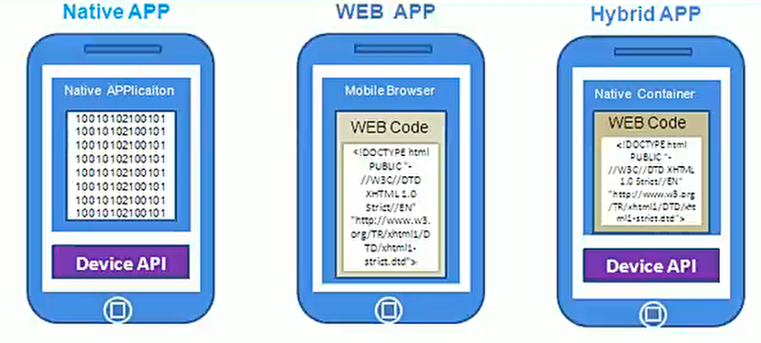
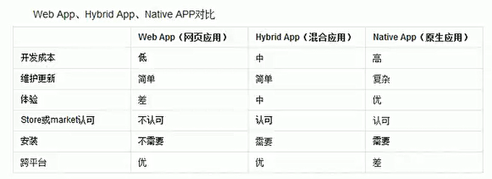
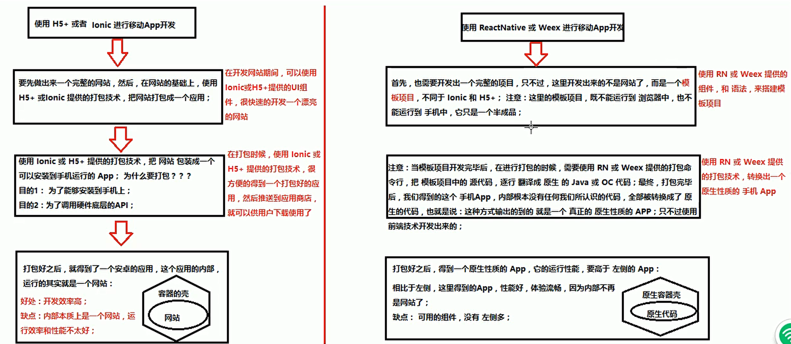

(注1：这个是黑马的视频，比较几个视频后，感觉还是这个老师讲的比较好，总共也就不到17个小时，比较适合我这种时间不够的人去稍微学一下。[视频链接](https://www.bilibili.com/video/BV1sJ411V77g?from=search&seid=7533021936045098292))

(注2：除了这个以外，还有个撩课的视频[惊呆了！3天完美入门React教程!](https://www.bilibili.com/video/BV17E411e7fQ?from=search&seid=3604146714163617142),也挺好的，以后有时间再看看。)

(注3：这个视频挺好的，现在我开始有些迷惑了，手机App，WebApp等这些东西的区别了，以前从来没有思考过这类问题。也去查了一下`React Native`开发工程师的薪资，最少也有15K，不过要求也挺高的，至少要掌握一个原生App的开发才行。)

(注4：所以说还是要多多的学习才行，尽管只是学个皮毛，只是入个门，但是可以扩展一下自己的视野，逐渐打破自己的局限性。)

(注5：现在是2021年3月3日，这个视频看着看着感觉有点不太对，后来我又找到了另一个黑马最新版本的视频，于是决定就先新版的视频了，这篇博文就暂且搁置了吧。)

# 移动App第1天

## 什么是混合移动APP开发

[开发IOS用什么语言?](https://www.zhihu.com/question/274744057/answer/378131057)

* 苹果上的软件是如何开发出来的：使用是的OC或者Swift这门语言。
* 安卓平台上的软件又是如何开发出来的：使用安卓相关的语言开发的，Java，安卓的控件进行开发。
* 苹果和安卓平台上共有的软件是如何开发出来的：比如QQ，是腾讯招两套开发人员(开发组)进行开发的。
* 现在可以通过前端移动App(Application)开发技术，去开发手机端的应用程序了(不用像以前那样招两套开发人员了），这种开发方式就叫做前端混合移动开发。
* 前端的混合移动App开发技术并没有使用苹果或安卓官方推荐的开发平台和开发方式，而是抛弃了官方提供的方式，使用前端的独有的技术进行移动App开发体验！

> 什么是移动App开发：通俗的理解，就是把开发Web网站的技术(HTML+CSS+JS)，通过**某种方式**，积植到移动App开发上进行使用，这种利用Web开发技术进行移动满开发体验的方式，叫做混合移动App开发！

### 关于移动App开发，需要知道的几个概念

[原生开发、Web开发、混合开发介绍](https://zhuanlan.zhihu.com/p/81983435)

[为什么App应用和Web应用开发区别很大？](https://www.zhihu.com/question/67907740/answer/257803772)

* 原生开发(NativeApp)：指的就是使用IOS或者Android官方提供的工具、开发平台、配套语言进行手机App开发的方式。(学这个最好穿越去2012年左右学比较好，现在学不合时宜了，时代变了。)
* Web版APP(HTML5)：可以在手机端浏览器里面打开的网站就是Web App，是利用Web技术进行的App开发，本质就是浏览器功能的叠加，用普通Web开发语言开发的，通过浏览器运行。Web技术本身需要浏览器的支持才能进行展示和用户交互，因此主要用到的技术是HTML5、JavaScript、CSS等。适合展示有大段文字、图片排版，且样式比较丰富的页面，很多通过vue和react框架编写的都是WebApp。
* 混合开发(HybirdApp)：就是使用前端已有的技术：HTML+CSS+JS，再搭配一些相关的打包编译技术，就能够开发出一个手机App，安装到手机中进行使用。
* 什么是App：App是Application的缩写，意思是可安装的应用程序。
* Арр的分类
  * 按照平台来划分
    * PC端：浏览器、代码编辑器(VSCode)、电脑QQ、英雄联盟、网易云音乐
    * 移动端：手机QQ、手机微信、手机爱奇艺、王者荣耀
  * 按照功能来划分
    * 游戏：愤怒的小鸟、植物大战僵尸、王者荣耀、英雄联盟
    * 应用：支付宝、淘宝、美团
* App和Web的区别
  * App概念：App是Application的缩写，意思是可安装的应用程序。
    * 优点：流畅、稳定、基本上一些App都可以脱网运行，用户体验好
    * 缺点：不能跨平台
  * Web概念：特指那些基于浏览器的Web网站(本质就是网页)
    * 优点：可以跨平台(只要你有一个浏览器，一个IP地址，就可以打开页面，不管你用的是什么操作系统的电脑，浏览器天生就是跨平台的)
    * 缺点：没有App流畅，不稳定，受限于网速和网络

## 为什么要学混合App开发

[现在的APP是原生开发多还是混合开发多?](https://www.zhihu.com/question/336049354/answer/758601109)

### 从程序员的角度分析

* 挣钱多(别人不会的你会，别人会的你精通)
* 对于找工作来说：市场需求量大，好找工作，提高我们的行业竞争力
* 能接触到前端流行的技术和框架(大公司基本都在用React，并且在React中我们全部都使用最新版的ES6语法。)
  * 前端是一个永恒的行业？(只要世界上还有浏览器的存在，必然需要前端，只不过，随着时间的推移，技术更新换代，可能我们对新技术的要求会越来越高。)
  * 屌丝的崛起之路：`只能做页面`——>`AJAX前后台数据交互`——>`jQuery、Bootstrap`——>`WebApp`——>`前端三大框架(解决WebApp开发的复杂性)`——>`可以做手机混合App/桌面应用`——>`可以做手机原生App`——>`或许将来可以发射火箭发射卫星`——>`终极目标：统一全宇宙`
  * (搞前端App开发)能购置一批牛逼的设备（苹果笔记本、IOS测试机、安卓手机(三星、华为、小米)）

### 从企业的角度分析(选择适合自身的移动App开发方式)

* 节省开发成本
  * 从工资上：尽最大的可能，压榨员工的剩余价值。(原来要招2个程序员：一个安卓一个IOS，现在只要招一个前端就可以了。)
  * 从时间上：因为原生的安卓和IOS开发，他们的开发的效率并不是很高，因为原生的代码复杂度比较高，因此原生的开发周期比较慢。如果采用移动App开发，那么，我们的开发周期会很短。因为HTML+CSS+JS足够简单。(对于前端开发App来说，有2种方式，其中，比较早的一种，也是比较简单的一种，就是，先开发出一个网站，然后再把网站运行一行打包的命令，就能得到一个App了。)

* 市面上常见的App开发方式
  *  WebApp：基于浏览器实现的，有特定功能的网站，称作WebApp
       * 例如：百度脑图、https://m.jd.com/，https://m.taobao.com/#index
         "
       *  优点：跨平台
       *  缺点：依赖网络，有白屏效果，相对来说，用户体验差；不能调用硬件底层得设备，比如摄像头；
  *  NativeApp：用android和Object-C等原生语言开发的应用
       *  优点：体验好；用户使用起来很流畅；非常适合做游戏【性能高】；可以直接调用硬件底层的API；
       *  缺点：不能跨平台（安卓手机和苹果手机要开发2套软件）
  *  HybirdApp：利用前端所学的知识去开发移动端App，兼具2者的优势
       *  优点：能够跨平台；体验会好一些；也能够调用硬件底层的API
       *  缺点：相对于原生体验稍微弱一丢丟；不适合做游戏；适合做非游戏类型的手机App
       *  应用场景：
    *  注意：使用Java或者IOS写出来的代码或程序，在最终运行的时候，普通的文本代码，都会被编译为原生的机器码去运行，并不像JS这样解析执行。Java代码是编译执行的。
         *  JS代码你写完了，就可以立刻执行了，然后解释器解释一行，就执行一行，直到遇到错误，后面的代码就不执行了。
         *  Java代码你写完了，不能立刻执行，它需要先进行预编译，编译器编译完后如果发现有错误，根本就不会去运行你的代码，会给你非常详细的报错信息，很贴心。

* 三种开发方式的原理和对比

  

  

* [谁在使用React Native?](http://reactnative.dev/showcase)

## 企业如何选择合适自己的App开发方式

[如何评价 React Native？](https://www.zhihu.com/question/27852694)

[在 2020 年，跨端开发时 Flutter 和 React Native 哪个更值得选择？](https://www.zhihu.com/question/384934444/answer/1250696834)

* 如果这个企业中，曾经使用原生技术开发过一些APP，那么在维护的时候，必然需要使用原生技术来维护
* 如果企业中，需要做一些游戏级别的应用，那么推荐使用原生，因为原生运行效率高，对耗电里处理的很好
* 如果企业做一些应用级别的非游戏软件，比如淘宝、京东、美团，就可以使用混合APP了；
* 在企业中，最主要的是好的点子，如果有了一个好的项目立案，那么最好要立即把这个项目做出来；这时候，使用混合App非常合适，因为开发周期很短，能快速上线，抢先占领市场；【裤衩开发：开发一个人，先只给它穿个小裤衩，以后再慢慢给它添加衣服。】

> 前2年比较流行Hybrid App开发，它里面是网页，外面套了一个安卓或者IOS的壳。
>
> 现在流行的是React Native开发，和原生开发几乎是一样的了，性能问题已经被突破了，剩下的问题就是组件不够丰富了。
>
> 现在好像又有了一个Flutter，感觉以后要取代React Native了，我只听说过，从来没有学过。

## 企业中项目开发流程

* **需求调研**：产品定位、受众群体、市场需求、开发价值；【产出物：需求文档]
* **产品设计**：功能模块、流程逻辑；【产出物：设计文档，交互稿】，确定项目的基本功能；
* **项目开发**：项目梁构、美工、前端、后台、测试【产品的把控】**要理解前后端分离的概念**
* **运营维护**：上线试运行、调Bug、微调功能模块、产品送代

> 根据需求搞设计，根据设计做开发。

## 企业技术选型——几大主流技术之间的关系

* Angular.js和Ionic
* Vue.js和Weex
* React.js和React-Native

> Angular，Vue ，React这三个都是前端框架，我们在进行混台App开发的时候，只是用到了这三个框架的基础语法而已。
>
> lonic，Weex，ReactNatvie这三个都是打包工具(提供了相关的命令行，只要运行指定的命令，就能够把项目打包成一个手机App出来)，能够把我们开发出来的应用，最终打包成个可安装的手机端程序安装包；同时，这三个东西，也提供了好用的一些小组件，方便我们去构建移动App的用户界面。

## 前端混合App开发框架

* HTML5+、ReactNative、Weex、Ionic

> HTML5+是一个产业联盟，它有一些互联网成员，专门在中国推广HTML5

## 开发框架之间的区别

* HTML5+和lonic
* ReactNative和Weex

## 使用HBuilder生成安卓应用（在线）

Hbuilder这个工具，是一个在线打包工具，使用很方便，不需要在本地配置开发环境；直接将做好的网站，通过一些简单的操作，就能在线打包为一个App出来；

> 它 的大多数客户都是一些中小型企业，大型企业肯定不用它。

* 在项目上右键->发行->发行为原生安装包

好处：本地不用配置开发环境；暴作方便对于程序员来说不关心打包的过程，打包过程对于我们来说是透明的；

缺点：程序员很少能干预打包的过程；源代码被提交到了云端的服务器，存在项目核心代码被泄露的风险；

## 环境变量的使用

作用：将需要全局使用的工具或者应用程序，配置到Path环境变量中，可以很方便的通过命令行的形式，在任何想要运行这些应用程序的地方，运行它们；