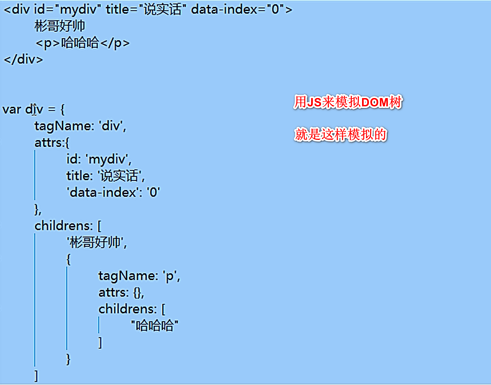
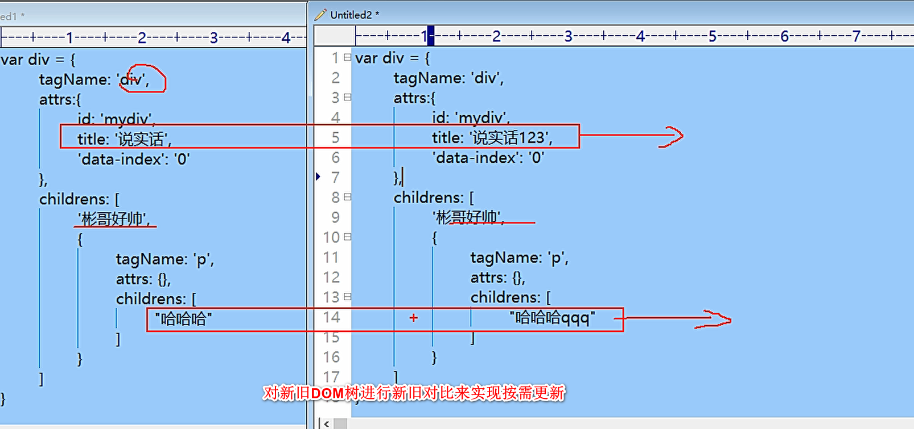

(注1：这是是黑马新版本的React课程，之前也看过一小部分黑马的老版本的React课程，后来感觉越学越不对劲，就没有继续看那个视频了。前几天找工作，人家问我会不会React，我说不会，然后就没有然后了，那我想着就趁着离职在家的这段时间里把React基础知识也学一遍吧。先学一遍黑马的，如果后面还有时间的话，再把后面撩课的视频也再重新学习一遍，就当作复习了。没有办法，2021年找工作和以前不一样了，对前端的要求也更加高了，所以只能去学习啊。)

(注2：现在是2021年3月3日，我其实还有很多事情要去做啊。要继续做Vue和小程序的新项目；要复习做过的旧项目；要背面试题；要复习以前的知识点，查漏补缺；要学习Vue源码；要学习TypeScript和Vue3.0；要学习React；要把Node.js视频看完，做一个项目吧；这样一看我估计2个月都不够啊，所以还是要抓紧时间啊，不过也只能慢慢来了，不能操之过急啊。一步一步的稳步向前走吧。)

(注3：老师应该是叫刘龙彬，讲的挺好的。)

# React简介

- React起源于Facebook的内部项目，因为该公司对市场上所有 JavaScript MVC 框架，都不满意，就决定自己写一套，用来架设Instagram(照片交友)的网站。做出来以后，发现这套东西很好用，**就在2013年5月开源了**。
- 与此对比：Angular1从2009年就出来了，是谷歌开发的。Angular1它是MVC类型的框架，刚开始就有设计缺陷，不支持组件化开发。(直到Angular2后才开始支持组件化开发，Angular1和2之间的断层非常厉害，而且学习曲线十分陡峭，是谷歌一群搞Java的人开发的前端框架，里面有很多Java的思想，对前端来说不太好理解，所以后面就慢慢衰落了。)
- 由于 React 的**设计思想极其独特**，属于革命性创新，性能出众，代码逻辑却非常简单。所以，越来越多的人开始关注和使用，认为它可能是将来 Web 开发的主流工具。
- 清楚两个概念：
  - library(库)：**小而巧**的库，**只提供了特定的API**；优点就是**船小好掉头**，可以很方便的从一个库切换到另外的库；但是**代码几乎不会改变**；
  - Framework(框架)：**大而全**的是框架；框架**提供了一整套的解决方案**(比如Vue全家桶)；所以，如果在项目中间，想切换到另外的框架，是比较困难的；

# 前端三大主流框架

> 三大框架一大抄。

- `Angular.js`：出来**较早**的前端框架，学习曲线比较陡，NG1学起来比较麻烦，NG2 ~ NG5开始，进行了一系列的改革，也提供了组件化开发的概念；从NG2开始，也支持使用TS（TypeScript）进行编程；
  - Angular在印度用的比较多。
- `Vue.js`：**最火**(关注的人比较多)的一门前端框架，它是中国人开发的，对我我们来说，文档要友好一些；
- `React.js`：**最流行**(用的人比较多)的一门框架，因为它的设计很优秀；

# React与vue的对比

## 组件化方面

* **什么是模块化：**是从**代码**的角度来进行分析的；把一些**可复用的代码**，**抽离为单个的模块**；便于项目的维护和开发；

* **什么是组件化：** 是从 **UI 界面**的角度来进行分析的；把一些**可复用的UI元素**，**抽离为单独的组件**；便于项目的维护和开发；

* **组件化的好处：**随着项目规模的增大，手里的组件越来越多；很方便就能**把现有的组件**，**拼接为一个完整的页面**；

* **Vue是如何实现组件化的：** 通过 `.vue` 文件，来创建对应的组件；
  * template   结构
  * script         行为
  * style           样式

* **React如何实现组件化**：大家注意，React**中有组件化的概念**，但是，**并没有像vue这样的组件模板文件**；React中，**一切都是以JS来表现的**；因此要学习React，JS要合格；ES6 和 ES7 (async 和await)要会用；

## 开发团队方面

- React是由FaceBook前端官方团队进行维护和更新的；因此，React的维护开发团队，技术实力比较雄厚；
- Vue：第一版，主要是有作者 尤雨溪 专门进行维护的，当 Vue更新到 2.x 版本后，也有了一个以尤雨溪为主导的开源小团队，进行相关的开发和维护；

## 社区方面

- 在社区方面，React由于诞生的较早，所以社区比较强大，一些常见的问题、坑、最优解决方案，文档、博客在社区中都是可以很方便就能找到的；
- Vue是近两年才火起来的，所以，它的社区相对于React来说，要小一些，可能有的一些坑，没人踩过；

## 移动APP开发体验方面

- Vue，结合Weex这门技术，提供了迁移到移动端App开发的体验（Weex，目前只是一个 小的玩具， 并没有很成功的大案例；）
- React，结合ReactNative，也提供了无缝迁移到 移动App的开发体验（RN用的最多，也是最火最流行的）；

# 为什么要学习React

* 和Angular1相比，React设计很优秀，一切基于JS并且实现了组件化开发的思想；

* 开发团队实力强悍，不必担心断更的情况；

* 社区强大，很多问题都能找到对应的解决方案；

* 提供了无缝转到 ReactNative 上的开发体验，让我们技术能力得到了拓展；增强了我们的核心竞争力；

* 很多企业中，前端项目的技术选型采用的是React.js；

#  React中几个核心的概念

## 虚拟DOM

- **DOM的本质是什么**：**浏览器中的概念**(只局限于浏览器端)，**用JS对象来表示页面上的元素**，并提供了操作 DOM 对象的API；
- **什么是React中的虚拟DOM**：是**框架中的概念**，是**程序员**用JS对象来**模拟**页面上的DOM元素和DOM嵌套；
- **为什么要实现虚拟DOM（虚拟DOM的目的）：**为了实现页面中， **DOM元素的高效更新**；
- **DOM和虚拟DOM的区别**：
  - **DOM：**是浏览器中的概念；用JS对象，表示页面上的元素，并提供了操作元素的API；
  - **虚拟DOM：**是框架中的概念；而是开发框架的程序员，手动用JS对象来模拟DOM元素和嵌套关系；
    - 本质： 用**JS对象**，来**模拟DOM元素和嵌套关系；**
    - 目的：就是为了实现页面元素的**高效更新**；

## Diff算法

> diff是different的所写，是2棵DOM树找差异的算法。

- **tree diff:**新旧两棵DOM树，**逐层对比的过程**，就是 Tree Diff； 当整颗DOM逐层对比完毕，则所有需要被按需更新的元素，必然能够找到；
- **component diff：**在进行Tree Diff的时候，每一层中，**组件级别**的对比，叫做 Component Diff；
  - 如果对比前后，**组件类型**相同，则**暂时**认为此组件不需要被更新；
  - 如果对比前后，组件类型不同，则需要移除旧组件，创建新组件，并追加到页面上；
- **element diff:**在进行组件对比的时候，如果两个组件类型相同，则需要进行元素级别的对比，这叫做 Element Diff；

# 创建基本的webpack4.x项目

* 运行`npm init -y` 快速初始化项目

* 在项目根目录创建`src`源代码目录和`dist`产品目录

* 在 src 目录下创建 `index.html` 和`main.js`。

* 使用 cnpm 安装 webpack ，运行`cnpm i webpack webpack-cli -D`
  * 如何安装 `cnpm`: 全局运行 `npm i cnpm -g`

* 注意：webpack 4.x 提供了 约定大于配置的概念；目的是为了尽量减少 配置文件的体积；
  * 默认约定了：
  * 打包的入口是`src` -> `index.js`
  * 打包的输出文件是`dist` -> `main.js`
  * 4.x中新增了 `mode` 选项(为必选项)，可选的值为：`development` 和 `production`;

# 暂停

现在是2021年4月20日，我在学习的过程中突然感觉，明明老师已经有了课件了，我再抄一遍太浪费时间了，老师课件里有的我就不抄了。

