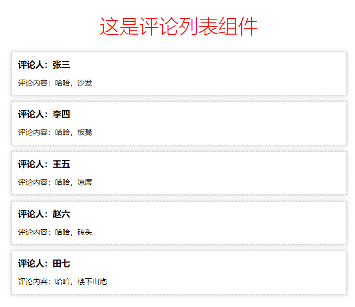
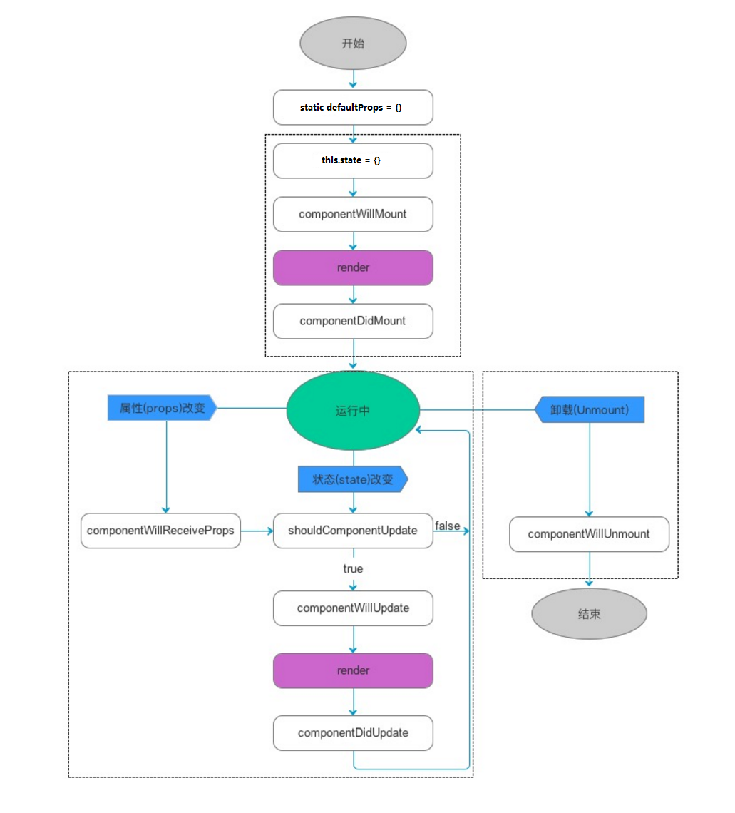
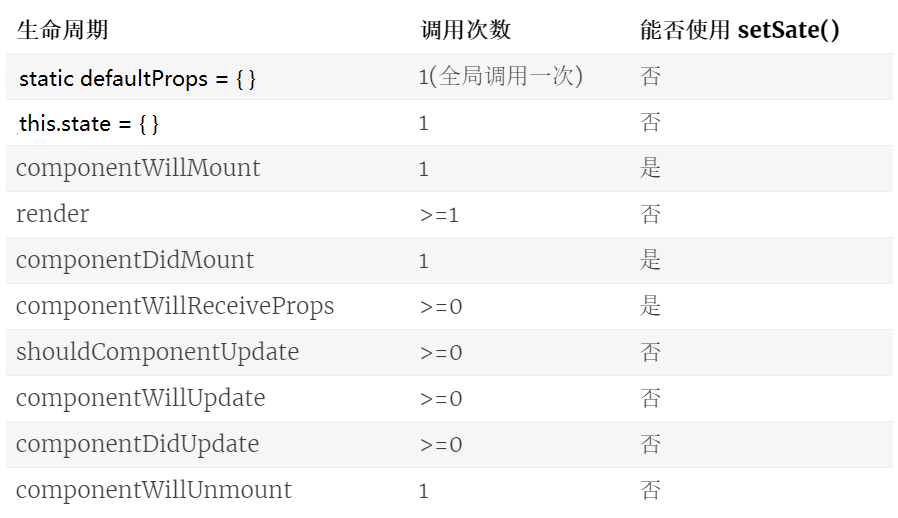

# React.js - 第2天


## 0. 安装 React Developer Tools 调试工具

[React Developer Tools - Chrome 扩展下载安装地址](https://chrome.google.com/webstore/detail/react-developer-tools/fmkadmapgofadopljbjfkapdkoienihi?hl=zh-CN)


## 主要内容

1. 学习 创建组件的第二种方式
2. 美化React组件的样式
3. 小Demo穿起来之前学习的知识点
4. React中绑定事件
5. React组件的生命周期


## 1. React中创建组件

### 第1种 - 创建组件的方式

> **使用构造函数来创建组件**，如果要接收外界传递的数据，需要在 构造函数的参数列表中使用`props`来接收；
>
> 必须要向外return一个合法的JSX创建的虚拟DOM；

- 创建组件：

  ```jsx
  function Hello () { 
  	// return null 
  	return <div>Hello 组件</div>
  }
  ```

- 为组件传递数据：

  ```jsx
  // 使用组件并 为组件传递 props 数据
  <Hello name={dog.name} age={dog.age} gender={dog.gender}></Hello>

  // 在构造函数中，使用 props 形参，接收外界 传递过来的数据
  function Hello(props) {
    // props.name = 'zs'
    console.log(props)
    // 结论：不论是 Vue 还是 React，组件中的 props 永远都是只读的；不能被重新赋值；

    return <div>这是 Hello 组件 --- {props.name} --- {props.age} --- {props.gender}</div>
  }
  ```

  ​

1. 父组件向子组件传递数据

2. 使用{...obj}属性扩散传递数据

3. 将组件封装到单独的文件中

4. 注意：组件的名称首字母必须是大写

5. 在导入组件的时候，如何省略组件的`.jsx`后缀名：

   ```js
   // 打开 webpack.config.js ，并在导出的配置对象中，新增 如下节点：
   resolve: {
       extensions: ['.js', '.jsx', '.json'], // 表示，这几个文件的后缀名，可以省略不写
       alias: {
           '@': path.join(__dirname, './src')
       }
     }
   ```

6. 在导入组件的时候，配置和使用`@`路径符号

### 第2种 - 创建组件的方式

> 使用 class 关键字来创建组件
>
> ES6 中 class 关键字，是实现面向对象编程的新形式；

#### 了解ES6中 class 关键字的使用

1. class 中 `constructor` 的基本使用
2. 实例属性和实例方法
3. 静态属性和静态方法
4. 使用 `extends` 关键字实现继承

#### 基于class关键字创建组件

1. 最基本的组件结构：

   ```jsx
   // 如果要使用 class 定义组件，必须 让自己的组件，继承自 React.Component
   class 组件名称 extends React.Component {
       // 在 组件内部，必须有 render 函数,作用：渲染当前组件对应的 虚拟DOM结构
       render(){
           // render 函数中，必须 返回合法的 JSX 虚拟DOM结构
           return <div>这是 class 创建的组件</div>
       }
   }
   ```


## 2. 两种创建组件方式的对比

> 注意：使用 class 关键字创建的组件，有自己的私有数据（this.state） 和 生命周期函数；
>
> 注意：使用 function 创建的组件，只有props，没有自己的私有数据和 生命周期函数；

1. 用**构造函数**创建出来的组件：叫做“无状态组件”【无状态组件今后用的不多】
2. 用**class关键字**创建出来的组件：叫做“有状态组件”【今后用的最多】
3. 什么情况下使用有状态组件？什么情况下使用无状态组件？
   + 如果一个组件需要有自己的私有数据，则推荐使用：class创建的有状态组件；
   + 如果一个组件不需要有私有的数据，则推荐使用：无状态组件；
   + React官方说：无状态组件，由于没有自己的state和生命周期函数，所以运行效率会比 有状态组件稍微高一些；

> 有状态组件和无状态组件之间的**本质区别**就是：有无state属性、和 有无生命周期函数；

4. 组件中的 `props` 和 `state/data` 之间的区别
   + props 中的数据都是外界传递过来的；
   + state/data 中的数据，都是组件私有的；（通过 Ajax 获取回来的数据，一般都是私有数据）；
   + props  中的数据都是只读的；不能重新赋值；
   + state/data 中的数据，都是可读可写的；


## 3. 渲染评论列表



### 通过for循环生成多个组件

1. 数据：

```js
CommentList: [
    { id: 1, user: '张三', content: '哈哈，沙发' },
    { id: 2, user: '李四', content: '哈哈，板凳' },
    { id: 3, user: '王五', content: '哈哈，凉席' },
    { id: 4, user: '赵六', content: '哈哈，砖头' },
    { id: 5, user: '田七', content: '哈哈，楼下山炮' }
]
```


## 4. 设置样式

1. 使用普通的 `style` 样式

   ```jsx
   <h1 style={ {color: 'red', fontWeight: 200} }></h1>
   ```

2. 启用 css-modules

   1. 修改 `webpack.config.js`这个配置文件，为 `css-loader` 添加参数：

      ```js
      { test: /\.css$/, use: ['style-loader', 'css-loader?modules'] } // 为 .css 后缀名的样式表  启用 CSS 模块化
      ```

   2. 在需要的组件中，`import`导入样式表，并接收模块化的 CSS 样式对象：

      ```js
      import cssObj from '../css/CmtList.css' 
      ```

   3. 在需要的HTML标签上，使用`className`指定模块化的样式：

      ```jsx
      <h1 className={cssObj.title}>评论列表组件</h1>
      ```

3. 使用`localIdentName`自定义生成的类名格式，可选的参数有：

   - [path]  表示样式表 `相对于项目根目录` 所在路径
   - [name]  表示 样式表文件名称
   - [local]  表示样式的类名定义名称
   - [hash:length]  表示32位的hash值
   - 例子：`{ test: /\.css$/, use: ['style-loader', 'css-loader?modules&localIdentName=[path][name]-[local]-[hash:5]'] }`

4. 使用 `:local()` 和 `:global()`

   - `:local()`包裹的类名，是被模块化的类名，只能通过`className={cssObj.类名}`来使用

     同时，`:local`默认可以不写，这样，默认在样式表中定义的类名，都是被模块化的类名；

   - `:global()`包裹的类名，是全局生效的，不会被 `css-modules` 控制，定义的类名是什么，就是使用定义的类名`className="类名"`

5. 注意：只有`.title`这样的类样式选择器，才会被模块化控制，类似于`body`这样的标签选择器，不会被模块化控制；


### 在项目中启用模块化并同时使用bootstrap

1. 把 自己的样式表，定义为 `.scss`  文件

2. 第三方的 样式表，还是 以 `.css` 结尾

3. 我们只需要为自己的 `.scss` 文件，启用模块化即可；

4. 运行`cnpm i sass-loader node-sass -D` 安装能够解析`scss`文件的loader

5. 添加loader规则：

   ```json
   { test: /\.scss$/, use: ['style-loader', 'css-loader?modules&localIdentName=[path][name]-[local]-[hash:5]', 'sass-loader'] } // 打包处理 scss 文件的 loader
   ```

   ​

## 5. React 中绑定事件的注意点

1. 事件的名称都是React的提供的，因此名称的首字母必须大写`onClick`、`onMouseOver`

2. 为事件提供的处理函数，必须是如下格式

   ```
   onClick= { function }
   ```

3. 用的最多的事件绑定形式为：

   ```jsx
   <button onClick={ () => this.show('传参') }>按钮</button>

   // 事件的处理函数，需要定义为 一个箭头函数，然后赋值给 函数名称
   show = (arg1) => {
       console.log('show方法' + arg1)
   }
   ```

4. 在React中，如果想要修改 state 中的数据，推荐使用 `this.setState({ })`


## 6. 绑定文本框与state中的值（单向数据流）

1. 在 Vue 中，默认提供了`v-model`指令，可以很方便的实现 `数据的双向绑定`；

2. 但是，在 React 中，默认只是`单向数据流`，也就是 只能把 state 上的数据绑定到 页面，无法把 页面中数据的变化，自动同步回 state ； 如果需要把 页面上数据的变化，保存到 state，则需要程序员手动监听`onChange`事件，拿到最新的数据，手动调用`this.setState({  })` 更改回去；

3. 案例：

   ```jsx
   <input type="text" style={{ width: '100%' }} value={this.state.msg} onChange={() => this.textChanged()} ref="mytxt" />

    // 响应 文本框 内容改变的处理函数
     textChanged = () => {
       // console.log(this);
       // console.log(this.refs.mytxt.value);
       this.setState({
         msg: this.refs.mytxt.value
       })
     }
   ```

   ​

## 7. 使用ref获取DOM元素引用

和 Vue 中差不多，vue 为页面上的元素提供了 `ref` 的属性，如果想要获取 元素引用，则需要使用`this.$refs.引用名称`

在 React 中，也有 `ref`, 如果要获取元素的引用`this.refs.引用名称`


## 8. 组件的生命周期

- 生命周期的概念：每个组件的实例，从 创建、到运行、直到销毁，在这个过程中，会出发一些列 事件，这些事件就叫做组件的生命周期函数；

- React组件生命周期分为三部分：

  - **组件创建阶段**：特点：一辈子只执行一次

  > componentWillMount: 
  > render：
  > componentDidMount: 

  - **组件运行阶段**：按需，根据 props 属性 或 state 状态的改变，有选择性的 执行 0 到多次

  > componentWillReceiveProps:
  > shouldComponentUpdate:
  > componentWillUpdate: 
  > render: 
  > componentDidUpdate: 

  - **组件销毁阶段**：一辈子只执行一次

  > componentWillUnmount: 

[vue中的生命周期图](https://cn.vuejs.org/v2/guide/instance.html#生命周期图示)
[React Native 中组件的生命周期](http://www.race604.com/react-native-component-lifecycle/)



### defaultProps

> 在组件创建之前，会先初始化默认的props属性，这是全局调用一次，严格地来说，这不是组件的生命周期的一部分。在组件被创建并加载候，首先调用 constructor 构造器中的 this.state = {}，来初始化组件的状态。

React生命周期的回调函数总结成表格如下：


组件生命周期的执行顺序：

1. **Mounting：**
   - constructor()
   - componentWillMount()
   - render()
   - componentDidMount()
2. **Updating：**
   - componentWillReceiveProps(nextProps)
   - shouldComponentUpdate(nextProps, nextState)
   - componentWillUpdate(nextProps, nextState)
   - render()
   - componentDidUpdate(prevProps, prevState)
3. **Unmounting：**
   - componentWillUnmount()


## 9. 通过Counter计数器的小案例 - 了解生命周期函数

1. 给 `props` 属性提供默认值 和 进行类型校验，需要先运行`cnpm i prop-types --save`

2. 给组件的 `props` 提供默认值

   ```js
     // 为组件提供 默认的 props 属性值
     static defaultProps = {
       initcount: 0 // 默认值为0    如果用户没有传递 ，则 默认就是0； 如果用户传递了，则 以用户传递的为准
     }
   ```

3. 给组件的 `props` 进行类型校验

   ```js
     // 3. 进行 props 属性的类型校验,   static propTypes = {}  是固定写法
     static propTypes = {
       initcount: PropTypes.number.isRequired // 规定 外界在传递 initcount 的时候，必须是 number 值类型，否则 ，会在终端报警告
       // isRequired 表示 这个 props 属性值 是必须要传递的
     }
   ```

   ​


## 10. 使用React中的事件，绑定count自增


## 11. 发表评论案例


## 相关文章

[类型校验](https://facebook.github.io/react/docs/typechecking-with-proptypes.html)
[Animation Add-Ons](https://reactjs.org/docs/animation.html#high-level-api-reactcsstransitiongroup)